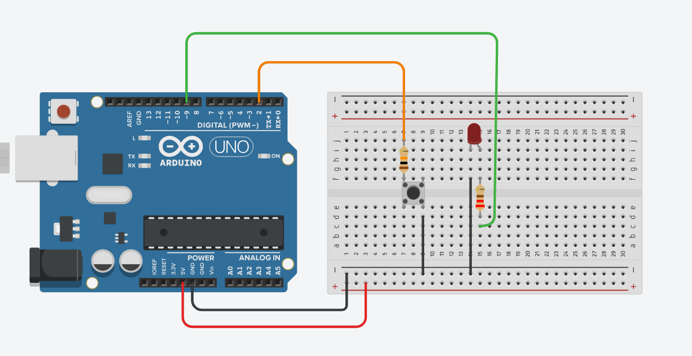

# Arduino Button LED Control

## Ziel
- LED mit einem Button steuern
- Input Pullup verstehen

## Was ich lerne
- Active-Low-Logik
- Debouncing
- Common Ground

## 🛠 Liste der Komponenten (Component List)

| Name | Menge (Quantity) | Komponente (Component) |
| :--- | :---: | :--- |
| U1 | 1 | Arduino Uno R3 |
| D1 | 1 | LED Rot (Red) |
| R1 | 1 | 220 Ω Widerstand (Resistor) |
| S1 | 1 | Drucktaster (Pushbutton) |
| R2 | 1 | 1 kΩ Widerstand (Resistor) |

```text
+-------------------------+
|         START           |
+-------------------------+
             |
             v
+-------------------------+
|      EINSTELLUNGEN      |
|  - Pin 9: AUSGANG       |
|  - Pin 2: EINGANG_PULLUP|
+-------------------------+
             |
             v
      /-------------\
      | HAUPTSCHLEIFE | <---------------------+
      \-------------/                         |
             |                                |
             v                                |
+-------------------------+                   |
|    LESE TASTER (Pin 2)  |                   |
+-------------------------+                   |
             |                                |
             v                                |
       /-----------\                          |
      / IST PIN 2   \        NEIN (Losgelassen)|
     <   LOW (0V)?   >------------------------+
      \  (Gedrückt) /                         |
       \-----------/                          |
             |                                |
             | JA (Gedrückt)                  |
             v                                v
+-------------------------+       +-------------------------+
|      LED ANSCHALTEN     |       |     LED AUSSCHALTEN     |
|   (digitalWrite HIGH)   |       |    (digitalWrite LOW)   |
+-------------------------+       +-------------------------+
             |                                |
             +---------------+----------------+
                             |
                             v
                  +---------------------+
                  |     WARTE 50ms      |
                  |    (Entprellen)     |
                  +---------------------+
                             |
                             |
                             +
```



